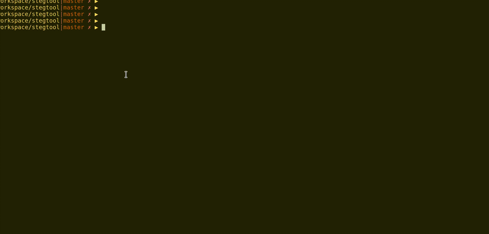

# pngrun

Dumb tool to run executables encoded into PNG images (using images encoded with [stegtool](https://github.com/djhworld/stegtool))

Example usage

    $ pngrun htop.png
    
## Building

Requires [steg](https://github.com/djhworld/steg) library to be available in `../`

    cargo build .

